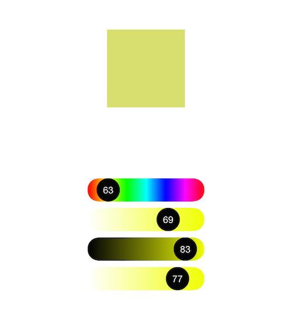
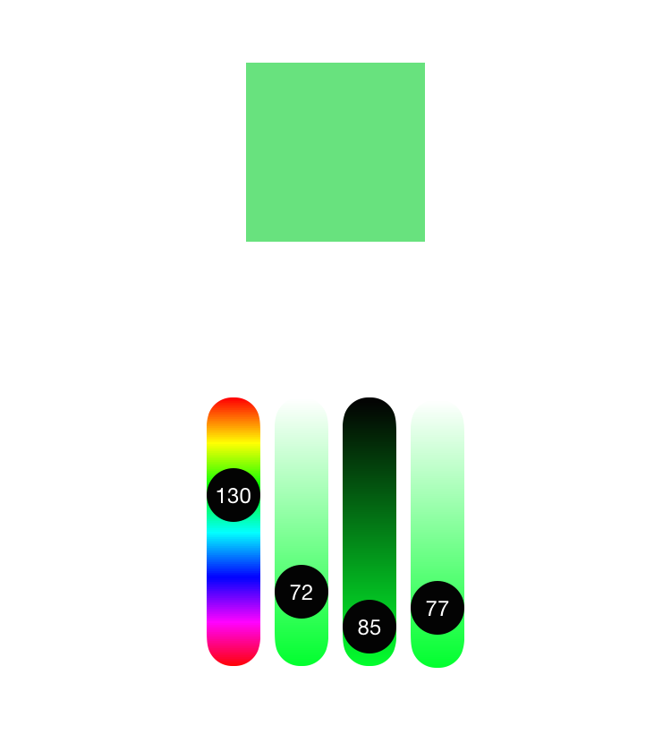
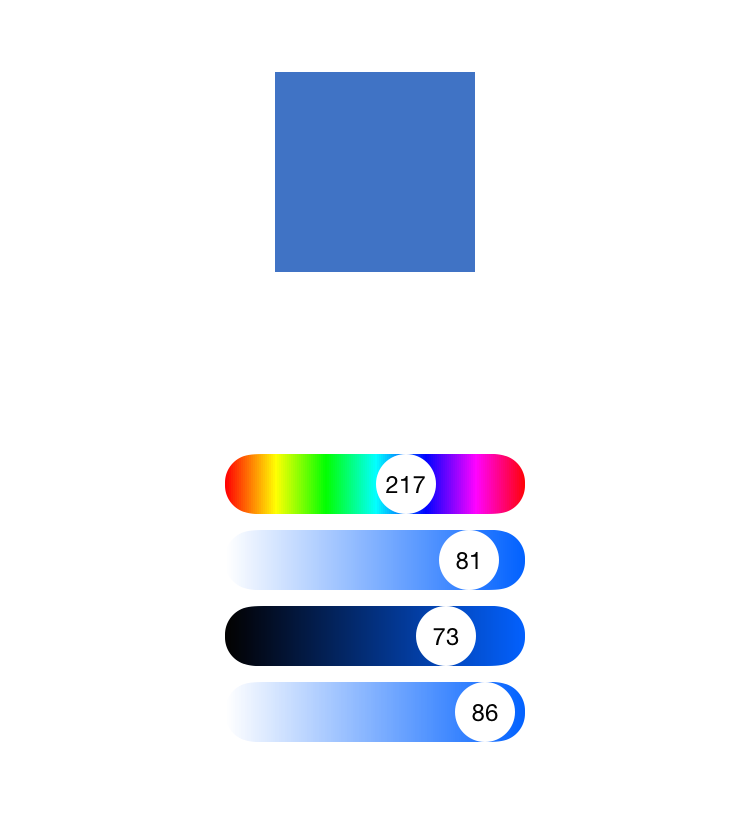
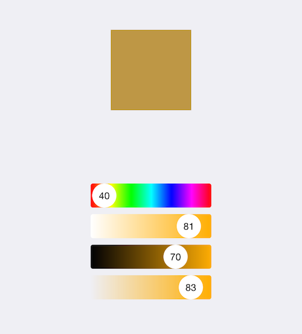

## SwiftHUEColorPicker

[](https://cocoapods.org/pods/SwiftHUEColorPicker)
[](https://cocoapods.org/pods/SwiftHUEColorPicker)
[](https://cocoapods.org/pods/SwiftHUEColorPicker)

iOS HUE color picker.



## Installation

**CocoaPods:**

```ruby
pod 'SwiftHUEColorPicker'
```

**Manual:**

Copy `SwiftHUEColorPicker.swift` to your project.

## Description

Supports two modes: *horizontal* and *vertical*.



You can also change the *saturation*, *brightness* and *alpha* values.

The control is customizable. You can customize the label:



Or the appearance:



## Using

You can create it from a *Storyboard* or *XIB*, or create it manually:

```swift
let picker = SwiftHUEColorPicker()
```

To handle value changes, implement the `SwiftHUEColorPickerDelegate` protocol:

```swift
picker.delegate = self

func valuePicked(color: UIColor, type: SwiftHUEColorPicker.PickerType) {
}
```

Direction:

```swift
picker.direction = SwiftHUEColorPicker.PickerDirection.Vertical // Vertical, Horizontal
```

Type:

```swift
picker.type = SwiftHUEColorPicker.PickerType.Color // Color, Saturation, Brightness, Alpha
```

Please see the example in this repository for how to use `SwiftHUEColorPicker`.

## License

`SwiftHUEColorPicker` is available under the MIT license. See the [LICENSE](LICENSE) file for more info.
